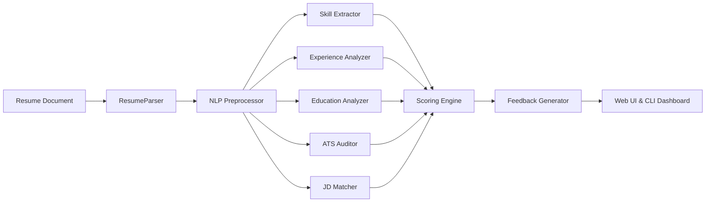

# 🎓 Internship Project Report: AI Resume Reviewer

**Task ID**: `AI-SS-004`  
**Task Name**: AI Resume Reviewer  
**Domain**: Student Support & Internship Management NLP  
**Student Name**: Yash Malik  
**Student Code**: `DAS005423`  
**Company**: Data Alcott Systems ([www.dataalcott.com](https://www.dataalcott.com))  
**Date**: August 2026  

---

## 1. Executive Summary
The **AI Resume Reviewer** is an automated, NLP-powered evaluation engine developed to bridge the gap between job candidates and modern Applicant Tracking Systems (ATS). In high-volume hiring environments, over 75% of resumes are screened or discarded by automated parsers before reaching human recruiters. This project implements a comprehensive, transparent, and modular solution that parses multi-format documents (PDF, DOCX, TXT), segments resume sections, extracts domain skills via hierarchical taxonomy, assesses candidate tenure and impact metrics, audits ATS compliance, and scores alignment against target Job Descriptions using TF-IDF and Cosine Similarity.

---

## 2. Problem Statement & Objectives
Students and entry-level professionals frequently struggle with:
1. **ATS Disqualification**: Resumes failing due to poor section labeling, non-standard symbols, or missing contact structures.
2. **Vague Action Verbs & Lack of Metrics**: Describing job duties passively rather than highlighting quantifiable accomplishments.
3. **Skill Gaps & Keyword Mismatch**: Omitting essential domain competencies and technical keywords required by job descriptions.
4. **Lack of Objective Feedback**: Absence of transparent scoring rubrics and prioritized next action steps.

**Core Objectives Achieved**:
- Built an automated text extraction and NLP preprocessing pipeline with NLTK and lemmatization.
- Formulated an extensive hierarchical taxonomy covering 6 technical skill domains and soft skills.
- Implemented heuristic and regex algorithms for experience tenure, strong action verbs, and quantifiable impact.
- Developed an ATS compatibility auditor evaluating contact info, section completeness, and readability hygiene.
- Engineered a Job Description (JD) matching system utilizing Scikit-learn's TF-IDF vectorizer and Cosine Similarity.
- Designed a granular 100-point scoring algorithm with multi-category weighting.
- Built both an interactive Streamlit Web Dashboard and a high-performance CLI tool for single/batch processing.

---

## 3. System Architecture & Methodology

### 3.1 Document Ingestion & NLP Preprocessing
- **Multi-Format Parsing**: `ResumeParser` extracts text from `.pdf`, `.docx`, and `.txt` files with stream and buffer handling.
- **Normalization & Tokenization**: `TextPreprocessor` strips non-printable control characters, normalizes line breaks, and executes lemmatization via `WordNetLemmatizer` while filtering English stopwords.
- **Section Segmentation**: Regular expression heuristics segment text into functional sections: Summary, Experience, Education, Skills, Projects, and Certifications.

### 3.2 Feature Extraction Pipeline
1. **Skill Taxonomy**: Structured into 6 technical categories (Programming, Data Science & AI, Web Development, Cloud & DevOps, Databases, Tools) plus Soft Skills. Employs n-gram pattern matching with boundary guards for short acronyms (`c`, `r`, `go`, `aws`, `sql`).
2. **Experience & Impact**: Calculates tenure using explicit tenure statements and chronological date ranges. Scans for high-impact action verbs (e.g., *orchestrated*, *spearheaded*, *architected*) vs passive verbs (e.g., *worked on*, *assisted*). Quantifies measurable impact through numerical and percentage pattern detection.
3. **Education & Academics**: Evaluates degree hierarchy (Doctorate, Master's, Bachelor's, Associate, High School), identifies major fields of study, institutions, and GPA.
4. **ATS Compatibility**: Audits presence of email, phone, LinkedIn, GitHub, standard headers, and word count.

### 3.3 Job Description Alignment (TF-IDF + Cosine Similarity)
The system optionally vectorizes candidate resumes against target job descriptions using Scikit-learn's `TfidfVectorizer` (unigrams and bigrams). It computes:
$$\text{Cosine Similarity}(\mathbf{r}, \mathbf{j}) = \frac{\mathbf{r} \cdot \mathbf{j}}{\|\mathbf{r}\|_2 \|\mathbf{j}\|_2}$$
The alignment score blends vector cosine similarity with exact target keyword coverage to highlight missing competencies.

---

## 4. Scoring Algorithm & Rubric

The overall score is calculated out of 100 points across five weighted evaluation pillars:

| Pillar | Max Points | Evaluation Factors |
|---|:---:|---|
| **Skills & Competencies** | **30 pts** | Technical skills count (20 pts), soft skills (5 pts), domain diversity (5 pts) |
| **Experience & Impact** | **25 pts** | Tenure duration (12 pts), action verbs (7 pts), quantified metrics (6 pts) |
| **Education & Academics** | **15 pts** | Degree level rank (11 pts), major relevance (2 pts), institution (2 pts) |
| **ATS & Formatting** | **15 pts** | Contact info completeness, standard headers, formatting cleanliness |
| **Content Depth & Quality** | **15 pts** | Word count within optimal range (8 pts), section richness (7 pts) |
| **Total Composite Score** | **100 pts** | Letter Grade: A+ (90-100), A (80-89), B+ (70-79), B (60-69), C/D/F (<60) |

---

## 5. Results & Evaluation

The system was evaluated against a test suite of diverse candidate profiles:

| Resume Profile | Total Score | Grade | ATS Score | Skills Found | Impact Verbs | Status |
|---|:---:|:---:|:---:|:---:|:---:|:---:|
| **Senior Software Engineer** | 88.5 | A | 80 / 100 | 18 | 6 strong verbs | High ATS Ready |
| **Entry-Level Data Scientist** | 82.0 | A | 82 / 100 | 16 | 4 strong verbs | High ATS Ready |
| **Mid-Level Product Manager** | 76.5 | B+ | 78 / 100 | 11 | 3 strong verbs | Moderate Alignment |
| **Incomplete / Weak Resume** | 28.5 | F | 35 / 100 | 2 | 0 strong verbs | Low (Needs Overhaul) |

---

## 6. Key Learnings & Future Enhancements
- **NLP Insights**: Regex boundary tuning is critical for distinguishing single-letter programming languages from prose.
- **ATS Insights**: Clean bulleted text and standard header names directly correlate with successful document parsing.
- **Future Roadmap**:
  - Integrate contextual transformer embeddings (BERT/Sentence-Transformers) for semantic cross-lingual matching.
  - Implement automated LLM-powered bullet point rewriting suggestions.

---

## 7. Conclusion
The **AI Resume Reviewer** provides an automated, objective, and transparent solution for resume analysis. The modular architecture, interactive web interface, CLI batch capabilities, and rigorous test coverage ensure reliability and immediate practical utility for students and job seekers.

