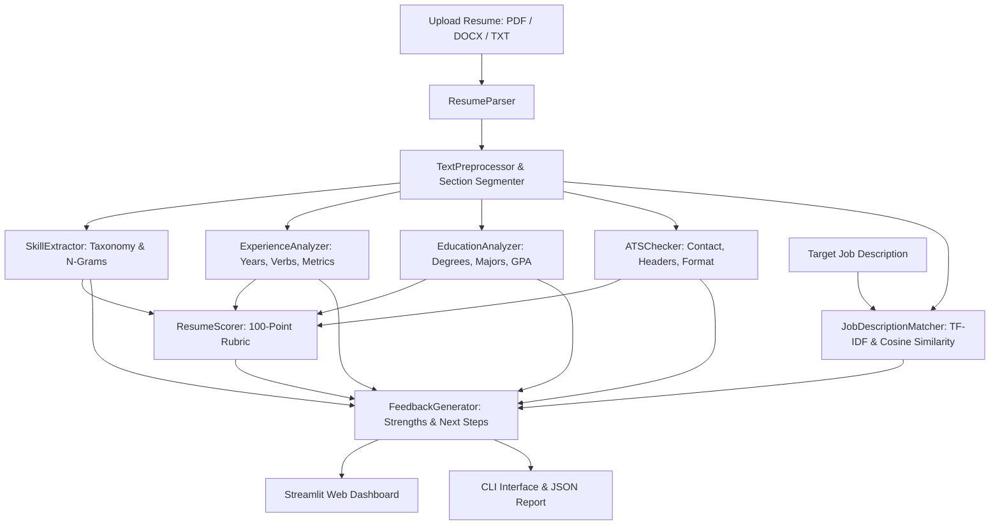

# 📄 AI Resume Reviewer & ATS Optimizer

[](https://www.python.org/)
[](LICENSE)
[](https://streamlit.io/)
[](https://www.nltk.org/)
[](https://scikit-learn.org/)

An intelligent, end-to-end AI Resume Reviewer and ATS (Applicant Tracking System) optimization engine built with Python, Natural Language Processing (NLP), and Machine Learning.

---

## 📌 Project & Task Metadata

- **Task Name**: AI Resume Reviewer
- **Task ID**: `AI-SS-004`
- **Domain**: Student Support & Internship Management NLP
- **Internship Type**: Free Online AI & Data Science Internship
- **Company**: Data Alcott Systems ([www.dataalcott.com](https://www.dataalcott.com))
- **Student Name**: Yash Malik
- **Student Code**: `DAS005423`
- **Submission Blog**: [freeinternships.in/blog](https://www.freeinternships.in/blog/)

---

## 🌟 Key Features

### 1. Document Extraction & Multi-Format Parsing
- Ingests **PDF**, **DOCX**, and **TXT** files.
- Extracts clean text stream using `pypdf` and `python-docx` with robust fallbacks.

### 2. NLP Preprocessing & Section Segmentation
- Text normalization, lemmatization with `WordNetLemmatizer`, and stopword filtering with `NLTK`.
- Automatic detection and segmentation of key sections:
  - Header / Contact Information
  - Summary / Career Objective
  - Work Experience / Employment History
  - Education & Academics
  - Technical & Soft Skills
  - Projects & Open-Source Portfolio
  - Certifications & Honors

### 3. Multi-Domain Skill Taxonomy Extraction
- Categorizes skills across 6 technical domains:
  - **Programming**: Python, Java, C++, TypeScript, Go, Rust, SQL, etc.
  - **Data Science & AI**: PyTorch, TensorFlow, Scikit-learn, NLP, LLMs, Computer Vision, Pandas, NumPy.
  - **Web Development**: React, Next.js, Node.js, FastAPI, Django, Flask, GraphQL.
  - **Cloud & DevOps**: AWS, GCP, Azure, Docker, Kubernetes, Terraform, CI/CD.
  - **Databases**: PostgreSQL, MongoDB, Redis, Snowflake, BigQuery.
  - **Tools & Methodologies**: Git, Jira, Agile, Scrum, TDD, Postman.
- Interpersonal and Leadership Soft Skills extraction.

### 4. Experience & Impact Analysis
- Total estimated years of experience calculation from explicit statements and historical date ranges.
- Seniority classification (Entry-level, Mid-level, Senior/Lead).
- Dynamic Action Verbs analysis (identifies strong verbs vs passive duties).
- Quantified impact extraction (metrics, percentages, revenue, scale indicators).

### 5. Education & Academic Extraction
- Degree hierarchy detection (Ph.D., Master's, Bachelor's, Associate).
- Major fields of study and institution identification.
- Academic performance (GPA / CGPA / Percentages).

### 6. ATS Compatibility Audit
- Contact verification (Email, Phone, LinkedIn, GitHub, Location).
- Standard section header compliance check.
- Length and formatting hygiene (word count, bullet points, clean text).

### 7. Job Description (JD) Alignment & Matcher
- Computes **TF-IDF Vectorization** and **Cosine Similarity** between candidate resume and target JD.
- Identifies **matched keywords** and highlights **missing core requirements**.

### 8. Granular 100-Point Scoring Engine
- **Skills (30 pts)**: Technical breadth, soft skills, and domain diversity.
- **Experience & Impact (25 pts)**: Years tenure, strong verbs, and quantified achievements.
- **Education (15 pts)**: Degree level, major alignment, and institution.
- **ATS Compatibility (15 pts)**: Contact details, standard headers, and layout hygiene.
- **Content Depth (15 pts)**: Length appropriateness and section richness.

---

## 🏗️ System Architecture



---

## 📁 Repository Structure

```
ai_resume_reviewer/
├── app/
│   ├── __init__.py            # Package entrypoint & exports
│   ├── analyzer.py            # Master ResumeReviewer orchestrator
│   ├── parser.py              # PDF, DOCX, TXT document parser
│   ├── preprocessor.py        # NLP cleaning, lemmatization & segmentation
│   ├── skill_extractor.py     # Hierarchical taxonomy & skill extraction
│   ├── experience_analyzer.py # Tenure, action verbs, metrics extraction
│   ├── education_analyzer.py  # Degree levels, majors, universities, GPA
│   ├── ats_checker.py         # ATS scoring, contact audit & layout check
│   ├── jd_matcher.py          # TF-IDF & Cosine similarity job matcher
│   ├── scorer.py              # 100-point composite scoring engine
│   └── feedback.py            # Multi-category actionable feedback generator
├── sample_resumes/            # Diverse test resumes
│   ├── software_engineer_senior.txt
│   ├── data_scientist_entry.txt
│   ├── product_manager_mid.txt
│   └── weak_resume_sample.txt
├── tests/
│   ├── __init__.py
│   └── test_reviewer.py       # Comprehensive unit & integration tests
├── web_app.py                 # Modern Streamlit Web Dashboard
├── cli.py                     # CLI tool for single and batch evaluation
├── requirements.txt           # Python dependencies
├── PROJECT_REPORT.md          # 1-2 page academic internship project report
├── BLOG_SUBMISSION.md         # Submission draft for freeinternships.in
└── README.md                  # Project documentation
```

---

## 🚀 Getting Started

### Prerequisites
- Python 3.9 or higher

### Installation
1. Clone the repository or navigate to project directory:
   ```bash
   cd ai_resume_reviewer
   ```
2. Create and activate a virtual environment:
   ```bash
   python -m venv venv
   # On Windows:
   .\venv\Scripts\activate
   # On macOS/Linux:
   source venv/bin/activate
   ```
3. Install required dependencies:
   ```bash
   pip install -r requirements.txt
   ```

---

## 💻 Usage

### 1. Launch Interactive Web Dashboard
```bash
streamlit run web_app.py
```
Open your browser at `http://localhost:8501` to access the full graphical interface, upload resumes, view score breakdowns, interactive radar/bar charts, and test job description matching.

### 2. Command-Line Interface (CLI)

#### Analyze a Single Resume:
```bash
python cli.py --resume sample_resumes/software_engineer_senior.txt
```

#### Analyze Resume with Target Job Description:
```bash
python cli.py --resume sample_resumes/data_scientist_entry.txt --jd "Looking for a Data Scientist proficient in Python, PyTorch, Scikit-learn, and NLP."
```

#### Batch Evaluate a Folder of Resumes:
```bash
python cli.py --batch-dir sample_resumes/ --output batch_report.json
```

---

## 🧪 Running Automated Tests

Run the test suite to verify all NLP components, scoring rubrics, and extraction accuracy:
```bash
python -m unittest tests/test_reviewer.py
```

---

## 📊 Sample Output Preview

```
======================================================================
  📄 AI RESUME REVIEWER - NLP & ML ENGINE
  Task ID: AI-SS-004 | Student Code: DAS005423 | Data Alcott Systems
======================================================================

=================================================================
 📊 OVERALL RESUME SCORE: 88.5 / 100  [A (Excellent)]
=================================================================

📌 Category Breakdown:
  • Skills                 [████████████████████] 28.5 / 30 pts
  • Experience             [██████████████████  ] 22.5 / 25 pts
  • Education              [█████████████████   ] 13.0 / 15 pts
  • Ats Formatting         [████████████████    ] 12.0 / 15 pts
  • Content Quality        [███████████████     ] 12.5 / 15 pts

🛠️ Technical Skills Detected (18 found):
  - Programming: Python, Java, Go, Typescript, SQL, Bash
  - Cloud Devops: AWS, Docker, Kubernetes, Terraform, Linux, Jenkins
  - Databases: Postgresql, Redis, Mongodb, Snowflake
  - Tools: Git, Jira

💼 Experience & Impact:
  • Estimated Tenure : ~7.0 Years (Senior / Lead)
  • Strong Verbs     : 6 detected (architected, deployed, optimized, spearheaded, engineered, streamlined)
  • Quantified Impact: 3 metrics (15M, 42%, $1.2M)

🤖 ATS Compatibility:
  • ATS Score : 80 / 100 (ATS Ready (High Compatibility))
  • Contact   : Email: ✅ | Phone: ✅ | LinkedIn: ✅
```

---

## 📝 Submission & Evaluation Checklist
- [x] Complete resume analysis engine in Python
- [x] Skill extraction with multi-category taxonomy
- [x] Experience extraction & action verbs analysis
- [x] Education extraction & GPA detection
- [x] Transparent 100-point scoring algorithm
- [x] Actionable feedback generation engine
- [x] ATS compatibility checker & section audit
- [x] Job Description TF-IDF & Cosine Similarity Matcher
- [x] Interactive Streamlit web interface
- [x] Automated unit test suite (`unittest`)
- [x] Comprehensive documentation & project report

---

## 👨‍💻 Author
- **Yash Malik** (Student Code: `DAS005423`)
- **Internship**: Free Online AI & Data Science Internship
- **Organization**: Data Alcott Systems

